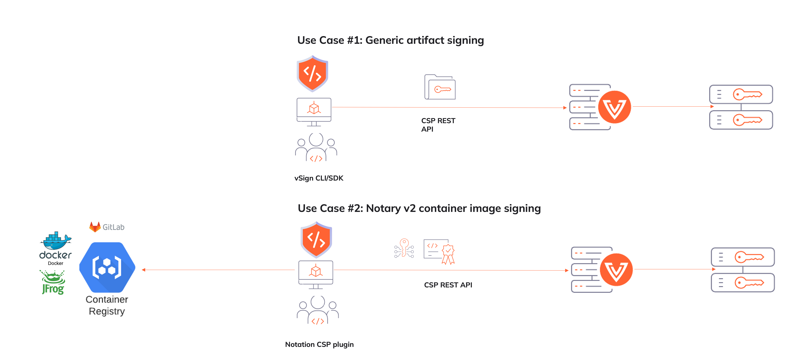

[](https://www.venafi.com/)
[](https://opensource.org/licenses/Apache-2.0)


[](https://codecov.io/gh/venafi/vsign)  
_**This open source project is community-supported.** To report a problem or share an idea, use
**[Issues](../../issues)**; and if you have a suggestion for fixing the issue, please include those details, too.
In addition, use **[Pull Requests](../../pulls)** to contribute actual bug fixes or proposed enhancements.
We welcome and appreciate all contributions. Got questions or want to discuss something with our team?
**[Join us on Slack](https://join.slack.com/t/venafi-integrations/shared_invite/zt-i8fwc379-kDJlmzU8OiIQOJFSwiA~dg)**!_

# VSign

VSign is a Go library, SDK, and command line utility designed to secure the code signing process by using the
[Venafi Trust Protection Platform](https://www.venafi.com/platform/trust-protection-platform)

## Use Cases
1. Generic artifact signing
2. Notary v2 signing [plugin](https://coolsolutions.venafi.com/ivan.wallis/notation-venafi-csp) that supports Venafi CodeSign Protect 
3. SDK (see simple use case [here](examples/simple-cli))



## Developer Setup
1. Configure your Go environment according to https://golang.org/doc/install.
2. Verify that GOPATH environment variable is set correctly.
3. Download the source code:

   `go get github.com/venafi/vsign`
4. Build the command line utility:

   `make vsign`

## Using vSign to integrate Venafi CodeSign Protect into your Code Signing workflow:

You can either use environment variables or a configuration file to customize interaction with the underlying WebSDK.

#### Pre-requisites for using with CodeSign Protect:
1. `vsign-sdk` API Integration has been created with the following minimum scopes: `codesignclient;codesign;certificate:manage,discover`
2. Code signing user is assigned to `vsign-sdk` API integration.
3. Code signing certificate has been granted the following permissions: `View,Read`.  This is needed since parts of the library retrieve the code signing certificate.

#### Create Environment variables

```
VSIGN_URL = "https://tpp.example.com"
VSIGN_TOKEN = "xxx"
VSIGN_JWT = "xxx"
VSIGN_PROJECT = "Project\\Environment"
VSIGN_TRUST_BUNDLE = "/my/path/chain.pem"
```

#### Create Configuration file (config.ini)

```
tpp_url = "https://tpp.example.com" 
access_token = "xxx"
jwt = "xxx"
tpp_project = "Project\\Environment"
trust_bundle = "/my/path/chain.pem"
```

For authentication only use either `access_token/VSIGN_TOKEN` or `jwt/VSIGN_JWT`, since the JWT will be exchanged for an access token.

`tpp_url` / `VSIGN_URL` = base URL for TPP

`access_token` / `VSIGN_TOKEN` = Access token for CodeSign Protect user with minimum scope:

```
codesignclient;codesign;certificate:manage,discover
```

certificate scope needed by some parts of vSign library for retrieving code signing certificates.

`tpp_project` / `VSIGN_PROJECT` = Path to CodeSign Protect environment to use for signing

`tpp_jwt` / `VSIGN_JWT` = JWT useful when TPP is configured for JWT authentication.  Helpful for automated pipelines where you would want to exchange and short-lived OIDC token for a (short-lived) TPP access token.  Only supported with JWT authentication introduced in 22.4.

`tpp_bundle` / `VSIGN_TRUST_BUNDLE` = Path to certificate chain in case of private chain of trust for Venafi TPP VOC

### Signing
   ```
   vsign sign --config test/config.ini --output-signature test/output.sig --payload test/data.txt --mechanism 64
   ```
* Refer to [vSign Mechanism compatibility guide](COMPATIBILITY.md) for list of supported Venafi CodeSign Protect PKCS#11 mechanisms
  
### Verification
   ```
   vsign verify --digest sha256 --signature output.sig --payload data.txt --key my.pub
   ```

### JWT Signing
   ```
   vsign jwt --config test/config.ini --header test/jwt_header.json --payload test/jwt_payload.json
   ```
* Refer to CodeSign Protect Developer guide for list of supported JWT signing algorithms

### Cosign Image Signing
   ```
   vsign sign --config test/config.ini --image myorg/myapp:v1 --mechanism 64
   ```

### Retrieve Access Token
   ```
   vsign getcred --url https://tpp.example.com --username test-cs-user --password MyPassword1234!
   
   access_token: P1sfL7l4uCWwH/zMkJY7IA==
   ```

   ```
   vsign getcred --url https://tpp.example.com --jwt ey...
   
   access_token: P1sfL7l4uCWwH/zMkJY7IA==
   ```

### What ** is not ** production ready?

While parts of `vsign` are stable, we are continuing to experiment and add new features.  The following feature set is not considered stable yet, but we are commiteted to stabilizing it over time!

**Note: the following providers require online access to CodeSign Protect for both signing and verification**

#### Jar Signing

Inspired by the [Relic](https://github.com/sassoftware/relic) project

```
vsign sign --config test/config.ini --payload test/hello.jar --output-signature ~/hello-signed.jar --digest sha256 --mechanism 1 --sig-type jar
```

Supported flags are:

`sections-only` - Don't compute hash of entire manifest
`inline-signature` - Include .SF inside the signature block
`apk-v2-present` - Add X-Android-APK-Signed header to signature

#### Jar Signature Verification

```
vsign verify --config test/config.ini --payload test/hello.jar --signature test/hello-signed.jar --digest sha256
```

You can also use jarsigner to perform verification:

```
jarsigner -verify hello-signed.jar
```

#### XML Signing

Inspired by the [Relic](https://github.com/sassoftware/relic) project

```
vsign sign --config test/config.ini --payload test/hello.xml --output-signature ~/hello-signed.xml --digest sha256 --mechanism 1
```

#### XML Signature Verification

```
vsign verify --config test/config.ini --payload test/hello.jar --signature test/hello-signed.jar --digest sha256
```